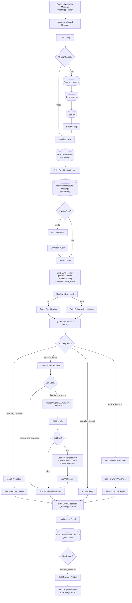

# Demo 01 — WhatsApp Agent (Real Estate Agency)

An AI-assisted WhatsApp agent for a real estate agency in Córdoba, Argentina.
It receives customer messages through the Meta WhatsApp Cloud API, classifies
each one with an LLM, and answers automatically — searching the property
catalogue, booking viewings, answering FAQs — or hands the conversation over
to a human when it is not confident.

The LLM step is **provider-agnostic**: it defaults to **Gemini** (free tier,
no card required) but switches to Anthropic or Groq with a single environment
variable — see [LLM Provider](#llm-provider) below.

All customer-facing copy is in Rioplatense Spanish, the way an Argentinian
agency would actually write to its clients.

## Problem It Solves

Real estate agencies get the same handful of questions over WhatsApp all day:
*"do you have 2-bedroom apartments in Nueva Córdoba?"*, *"what do I need to
rent?"*, *"can I see it on Thursday?"*. Answering them manually eats the
sales team's day and leads go cold outside business hours.

This agent handles those three cases end to end and, critically, knows when to
stop: anything ambiguous, contractual, or low-confidence is escalated to a
human with the full context, instead of guessing.

## Flow



### The four intents

| Intent | What triggers it | What the agent does |
|---|---|---|
| `consulta_propiedad` | Asking for properties to rent or buy | Filters and scores the catalogue, replies with the top 3 matches |
| `agendar_visita` | Proposing or requesting a viewing | Validates date/time against business hours, asks which property if it isn't known, checks the agency calendar is free, and books it |
| `consulta_general` | Hours, address, requirements, fees, valuations | Answers from a static FAQ set — no LLM call |
| `derivar_humano` | Complaints, contractual/legal topics, "I want to talk to someone", or low classifier confidence | Alerts the owner with full lead context, acknowledges to the customer |

### Design decisions worth noting

- **The agency owns its own data, in a spreadsheet.** The catalogue, the
  business details and the FAQ answers live in the client's Google Sheet —
  three tabs, editable by someone who has never seen n8n. That is the
  difference between a demo and something an agency can actually run: without
  it, adding a listing means editing the workflow. Auth is a **service
  account**, so onboarding is *share this spreadsheet with an email address* —
  no consent screen, no Google Cloud project per client, and no refresh token
  expiring every seven days. The sheet is re-read every 5 minutes rather than
  on every message; the race between two executions refreshing at once is
  harmless because this is a cache, not state. If Sheets fails **or a tab comes
  back empty**, the JSON bundled in the workflow is used instead and the reason
  is logged — an outdated catalogue beats telling a customer the agency has no
  properties because of an API blip.
- **Parsing the spreadsheet is the actual work.** The integration is two node
  types; what earns its tests is that a human wrote the cells. `420.000`,
  `$ 420.000` and `USD 52.000` are all prices; `sí`, `x` and `TRUE` all mean
  yes; `75 m2` is seventy-five, not seven hundred and fifty-two — that one was
  a real bug, caught by a test, from stripping non-digits instead of taking the
  first number. Nothing throws: an unreadable cell becomes `null` and the
  listing takes part in fewer searches, because dropping a real property over a
  malformed field means the customer never learns it exists.
- **Opening hours have one home.** They used to live in six places: three
  constants that validated bookings and four strings that told the customer
  about them. That was a nuisance; with a spreadsheet in front of it, it would
  have become a contradiction — the agency writes "9 to 20", the FAQ says so,
  and the bot keeps rejecting 19:30. The `negocio` tab now drives the
  validation *and* the copy, and FAQ answers reference `{{horarios}}` instead
  of spelling the times out, so the two cannot drift apart.
- **Provider-agnostic LLM step.** `Build LLM Request` reads `LLM_PROVIDER`,
  `LLM_MODEL` and `LLM_API_URL` and builds the right URL, headers and body for
  Gemini, Anthropic or Groq. Swapping providers is a config change, not a
  workflow edit.
- **One LLM call, not two.** The model returns the intent *and* the extracted
  entities (operation, property type, neighbourhood, bedrooms, bathrooms,
  budget, date, time) in a single request, because the property search needs
  those entities anyway.
- **Conversation memory, keyed by phone number.** A real WhatsApp exchange
  splits one request across several messages: *"busco depto en Nueva Córdoba"*
  then *"algo de un dormitorio"*. The second names neither the neighbourhood
  nor the operation, so on its own it searches the whole catalogue. The last 6
  messages and the entities gathered so far are kept per phone number (dropped
  after 30 minutes of inactivity) and used two ways: the history goes into the
  prompt so the model can resolve *"ese"* or *"algo más barato"*, and the
  stored entities are merged with the new ones before routing. The merge runs
  in code (`conversationMemory.js`), so carrying context forward is
  deterministic and testable — a newly supplied value overrides the stored one,
  an absent one leaves it standing. See
  [why it uses a data table](#why-a-data-table-and-not-workflow-static-data).
- **Memory also records what the agent showed, not just what the customer
  said.** *"Me interesa el de Las Flores"* is the natural way to pick one of
  three listings, and it is unresolvable from the customer's messages alone —
  the listings were in the agent's reply, which the customer's own history does
  not contain. So the codes of the last batch shown are stored alongside the
  entities and go into the prompt as a numbered list, which is what makes *"el
  primero"* and *"el de Las Flores"* mean something. It is recorded in `Log
  Delivery Result`, the last Code node every branch passes through and the
  first point where the search has actually run.
- **Voice notes go straight to the model, not to a transcription service.**
  Half the enquiries a real agency gets are audio, so treating them as
  "unsupported" hands most of the work back to a human. Meta's webhook carries
  a **media ID** rather than the file: one call trades it for a short-lived
  download URL, a second fetches the audio, and the bytes ride along with the
  classification prompt as `inline_data`. **One Gemini call** then returns the
  transcript, the intent *and* the entities — no separate speech-to-text
  service to pay for, wire up, or keep in sync with the classifier. The
  transcript replaces the placeholder in conversation memory, so a follow-up
  message sees what was said, and audio and text mix freely in one
  conversation. Text messages skip both HTTP calls entirely.
- **Property results come with photos, one message each.** A wall of text is
  not how anyone shops for a home. The reply is split: a short text message
  saying what was found, then one image per property with its details as the
  caption — which is how an agency actually sends listings, and reads far
  better in a chat. Meta fetches each image from a public URL, so the photo is
  a field on the listing rather than an upload. Properties without a photo
  aren't dropped: their details fall back into the text message. The photos are
  sent at the very end of the flow, after the text and after memory is saved,
  so they arrive in the right order and a failed image can't cost the customer
  their answer.
- **Visits are booked in a real Google Calendar.** Before booking, the workflow
  queries **freeBusy** on the agency calendar: if the slot is taken the
  customer gets the nearest free times of that same day instead of a double
  booking. The event carries the customer's name, phone and the property's real
  address, so the agent knows who and where without opening the CRM.
- **The agent asks for what the agency needs, and nothing else.** The one thing
  it insists on beyond the date is *which* property — a booking without it
  leaves the owner with an appointment and no idea what to show. That question
  doubles as an offer (*"si todavía no elegiste, decime qué buscás y te muestro
  las que tengo"*), so a customer who hasn't chosen lands in the property
  search instead of a dead end, and the date waits in conversation memory
  meanwhile. The **email is optional**: it is what Google needs to email the
  invitation, but the customer already has their confirmation in the chat, so
  asking for it would buy little and blocking the booking without it would be
  the worst of both worlds. When it does show up, the customer is added as a
  guest and `sendUpdates: all` makes Google send the invitation.
- **Times are anchored to Córdoba, not to the server.** Code nodes inherit the
  process timezone, which in the Docker deployment is UTC. That was harmless
  while the agenda was a mock; with a real calendar it books the viewing three
  hours off, and after 21:00 Argentine time "tomorrow" resolves to the wrong
  day. `localTime.js` keeps two explicit representations — wall-clock time for
  calendar arithmetic, real instants for anything compared against Google — and
  every date sent to Calendar carries the `-03:00` offset. `npm test` runs the
  whole suite twice, once in the machine's timezone and once in UTC, because
  this is precisely the class of bug that passes locally and fails on deploy.
- **A greeting can never become a booking.** With a date and a property still
  in memory, *"hola buenas"* was classified as a continuation of the previous
  request and booked a viewing nobody asked for. Two independent guards now
  prevent it: a booked visit drops its date, time and property from memory, and
  a message that is only a greeting is forced to `consulta_general` in code —
  not in the prompt, because that is precisely the kind of judgement this
  workflow does not delegate to the model.
- **The model's output is never trusted.** `Parse Classification` re-parses the
  JSON (tolerating markdown fences), checks the intent against a whitelist and
  enforces a minimum confidence of `0.6`. Anything that fails becomes
  `derivar_humano` — regardless of which provider produced it.
- **FAQs don't hit the LLM.** Keyword matching is instant, costs no tokens and
  always returns the same answer — which is what you want for facts like
  commission rates.
- **The search degrades gracefully — and says so.** If nothing matches exactly,
  it drops the neighbourhood filter first, then widens the budget by 15%,
  rather than replying "nothing found". When it relaxes, the reply names what
  it actually searched for: *"No encontré departamentos de 2 dormitorios en
  Alberdi, pero…"*. That matters because entities accumulate across messages —
  a customer asking *"¿tenés en Alberdi?"* after mentioning two bedrooms is
  still being filtered on two bedrooms, and a bare "nothing in that
  neighbourhood" reads as plainly wrong when there *is* something in Alberdi
  with one bedroom. Naming the filters lets the customer correct them.
- **City is a filter, not a suggestion.** The catalogue spans two towns —
  Córdoba capital and Río Tercero, ~100 km apart — so the neighbourhood alone
  is ambiguous: *Alberdi* is a barrio of both. Every listing carries a `ciudad`,
  and unlike the neighbourhood it is **never relaxed**: if there is nothing in
  the town the customer asked about, the agent says so and offers a human,
  rather than helpfully showing something an hour's drive away. Neighbourhood
  matching also ignores a leading *"Barrio"*, since the proper name sometimes
  includes it (*Barrio Norte*) and sometimes doesn't (*Las Flores*), while
  customers write it either way.
- **Explicit error handling on both external APIs.** See below.

### Why a data table, and not workflow static data

`$getWorkflowStaticData` is the obvious choice for "persist something without
extra infrastructure" — this demo already uses it for the mock visits
spreadsheet — but it does not work for conversation memory, and the reason is
worth spelling out because it isn't obvious until it bites.

n8n loads static data **when an execution starts** and writes it back **when
that execution ends**. There is no locking in between. Two messages sent a few
seconds apart are exactly the case this feature exists for, and classification
takes several seconds, so the two executions overlap. Measured here on the
first attempt:

| Execution | Started | Finished |
|---|---|---|
| message 1 | `05:12:33.628` | `05:12:41.624` |
| message 2 | `05:12:37.966` | `05:12:48.251` |

Message 2 read the store at ~`:38`, four seconds before message 1 had written
anything. Both started from the same empty snapshot, and the one that finished
last overwrote the other — message 1 vanished from the history entirely, and
message 2 was classified with no context at all.

A data table row is written **when the node runs**, not when the execution
ends, so writing the inbound message *before* the LLM call is enough for the
next execution to find it. Two different customers can never clobber each
other either, since they are separate rows rather than one shared blob.

The remaining edge, documented rather than hidden: when two messages overlap,
the *entity* merge of the second still runs against the state read before the
first one finished classifying, so accumulated entities can lag by one message.
The message history is unaffected, and the prompt tells the model it may
restate values from the context, so the classification itself still sees the
full request. Closing that gap completely would mean re-reading the row after
classification — three more nodes for a case where the answer is already
correct, which didn't seem a good trade for a demo.

### Error handling

| Failure | Behaviour |
|---|---|
| LLM API is slow or down | HTTP node retries 3× (2 s apart). If it still fails, the error output routes to `Build Fallback Classification`, which forces `derivar_humano` — the customer always gets an answer and the owner is notified. The alert names which provider failed and why, in plain language: `llmFailureReason.js` maps the HTTP status to a readable cause instead of pasting n8n's raw error, which otherwise leaks tooling copy (a Gemini quota error arrives as *"Try spacing your requests out using the batching settings under 'Options'"*) into a message read by the agency owner. |
| LLM returns malformed JSON, an unknown intent, or a safety-blocked empty response | `Parse Classification` catches it (via `extractLlmText`, which returns `null` instead of throwing) and falls back to `derivar_humano`. |
| Owner notification fails | `Notify Owner` continues on error, so the customer still receives their reply. |
| Reply delivery fails | `Send WhatsApp Reply` retries 3×; the outcome is recorded by `Log Delivery Result`. No alert is attempted over WhatsApp — if WhatsApp is down, that alert would fail too. |
| Unknown intent reaches the router | The Switch's fallback output routes it to `derivar_humano`. |
| The LLM call failed, so this message has no entities | `Update Conversation Memory` sits after *both* classifier branches, so a fallback still records the message and keeps the entities gathered earlier — one failed call doesn't wipe the customer's context. |
| The `whatsapp_conversations` table is missing, or a data table node errors | All three data table nodes are set to continue on error with `alwaysOutputData`, so the flow runs without memory rather than leaving the customer unanswered. Memory is an enhancement, not a dependency — this is also what makes the workflow importable and runnable before the table exists. |
| `LLM_PROVIDER` set to something unsupported | `Build LLM Request` throws immediately with a clear message — this is a deploy-time misconfiguration, not a per-message failure, so it is surfaced as a failed execution rather than silently guessed at. |
| Google Calendar is unreachable when checking availability | `Resolve Slot` treats the day as free and lets the booking proceed. Refusing to book because the agenda couldn't be *read* is worse for the customer than an occasional overlap, and if Calendar is down the create call will fail next anyway — which is handled on its own line. |
| Creating the calendar event fails | The visit is still recorded locally and the reply falls back to *"an agent will confirm shortly"*. It never promises an invitation that isn't coming: `Format Scheduling Reply` only mentions the email if Calendar actually returned an event ID. |
| The customer's slot is already taken | Not an error — `Resolve Slot` marks it `horario_ocupado` and the reply offers the nearest free times of that same day. |

## Requirements

- **n8n** 2.x (built and verified against 2.8.4 / `n8n-nodes-base` 2.8.1)
- **Node.js** 18+ (developed on 22) — only needed to run the tests and the build script
- A **Meta for Developers** account with a Business-type app that has the
  **WhatsApp** product added (free — includes one test phone number)
- An API key for **one** LLM provider — a free
  [Google AI Studio](https://aistudio.google.com/apikey) key works out of the
  box (default), or an Anthropic/Groq key if you prefer
- A **Google account** with the Calendar API enabled and an OAuth client, for
  booking visits (free) — see [step 4](#4-google-calendar-setup). Without it
  the agent still answers everything else; only the booking step degrades to
  *"an agent will confirm"*
- A public URL for your n8n instance so Meta can reach the webhook
  (n8n Cloud gives you one; for local development use a tunnel such as
  `ngrok http 5678`) — **set this up before activating the workflow**: the
  WhatsApp Trigger node registers its own webhook subscription with Meta's
  Graph API the moment the workflow activates, and that call fails if the
  URL isn't reachable yet

No npm dependencies — the custom code uses only the Node standard library.

## Setup

### 1. Meta WhatsApp Cloud API setup

1. Go to [Meta for Developers](https://developers.facebook.com/apps) and
   create an app (type **Business**), or use an existing one.
2. In the app dashboard, add the **WhatsApp** product.
3. Under **WhatsApp → API Setup** you get, for free, a **test phone number**
   plus everything below it — note these down, you'll need them shortly:
   - **Phone number ID** (an opaque numeric ID, not the phone number itself)
   - **WhatsApp Business Account ID**
   - A **temporary access token** (valid ~24h — enough to finish this setup;
     see the note below for one that doesn't expire)
4. While the app is in **development mode**, Meta only delivers messages to
   numbers you've explicitly added as testers. Still on the API Setup page,
   add every phone you want to test with — including the agency owner's —
   and verify each one with the code Meta sends it.
5. Get the app's **App ID** and **App Secret** from **App Settings → Basic**.
   These are separate from the access token above: n8n's WhatsApp Trigger
   node uses them to verify the webhook signature and to register itself
   with Meta's Graph API.

> **Don't configure the webhook by hand in Meta's dashboard.** n8n's
> WhatsApp Trigger node registers its own webhook subscription via the
> Graph API the moment you activate the workflow — there's no callback URL
> to paste in manually. See [Import and run](#7-import-and-run) below. Just
> make sure your n8n instance already has a public URL before you activate
> it.

> **Temporary token expired?** Generate a permanent one instead: **Business
> Settings → Users → System Users** → create a system user → **Generate
> token**, scoped to `whatsapp_business_messaging` and
> `whatsapp_business_management` on your app.

### 2. Create the conversation memory table

In n8n, open **Data tables** (next to Workflows and Credentials) and create one
named exactly `whatsapp_conversations`, with three `String` columns:

| Column | Holds |
|---|---|
| `telefono` | The customer's number, digits only — the key, one row per person |
| `estado` | The conversation state as JSON: recent messages and accumulated entities |
| `actualizadoEn` | ISO timestamp of the last message, for eyeballing the table |

The workflow references the table **by name**, the same way it references
credentials, so it links up on import without editing any node.

If you skip this step the workflow still runs — the data table nodes are set to
continue on error, and the agent simply behaves as it did before, classifying
each message on its own.

> Rows are never deleted: an expired conversation is ignored on read (30
> minutes of inactivity) and overwritten the next time that number writes. For a
> long-running deployment, prune the table periodically on `actualizadoEn`.

### 3. Google Sheets setup

The catalogue, the business details and the FAQ come from a spreadsheet the
agency owns. **This step is optional** — skip it and the workflow uses the JSON
bundled inside it, which is what the demo ships with.

1. Build the spreadsheet from [`sheets-template/`](sheets-template/): three
   CSVs to import as three tabs named `propiedades`, `negocio` and `faq`. They
   are generated from the demo's own data, so the agent behaves identically
   before and after connecting it — which is how you tell the connection works.
2. In [Google Cloud Console](https://console.cloud.google.com/) (the same
   project as step 4 is fine): **APIs & Services → Library** → enable the
   **Google Sheets API**.
3. **IAM & Admin → Service Accounts → Create service account**. Name it
   something like `n8n-sheets`. No roles needed — access is granted per
   spreadsheet, not per project.
4. Open it → **Keys → Add key → Create new key → JSON**. A file downloads.
5. **Share the spreadsheet with the service account's email address**
   (`something@your-project.iam.gserviceaccount.com`), exactly as you would
   share it with a colleague. **Viewer** is enough — the workflow only reads.
6. Set `SHEETS_DOCUMENT_ID` to the spreadsheet's ID: the long string between
   `/d/` and `/edit` in its URL.

> **Why a service account and not OAuth:** onboarding a client becomes
> *"share this sheet with this address"* instead of walking them through a
> consent screen and a Google Cloud project of their own. It also sidesteps the
> refresh token that expires every 7 days while an OAuth app is in *Testing* —
> the limitation the Calendar credential in the next step does have to live
> with. Calendar can't use a service account, because one cannot invite
> attendees without Workspace domain-wide delegation.

> **A working example spreadsheet is not linked here on purpose.** Publishing
> one from this repo would mean sharing a live Google document whose contents
> nobody is maintaining; the CSVs in `sheets-template/` are the same thing,
> versioned, and take about a minute to import.

### 4. Google Calendar setup

Visits are booked in a real calendar, and the customer gets the invitation by
email. That needs an OAuth client — a service account will not do: without
Google Workspace domain-wide delegation, a service account cannot invite
attendees, which is the whole point.

1. In [Google Cloud Console](https://console.cloud.google.com/), create a
   project (or reuse one).
2. **APIs & Services → Library** → enable the **Google Calendar API**.
3. **APIs & Services → OAuth consent screen** → **External**, fill in the app
   name and your email. While the app is in *Testing*, add your own Google
   account under **Test users** — otherwise the consent screen refuses it.
4. **APIs & Services → Credentials → Create credentials → OAuth client ID** →
   type **Web application**. Under **Authorized redirect URIs** paste the URL
   that n8n shows in the credential screen in the next step — for a local
   instance it is `http://localhost:5678/rest/oauth2-credential/callback`.
5. Copy the **Client ID** and **Client Secret**.
6. Note the **calendar ID** for `GOOGLE_CALENDAR_ID`. For your main calendar
   that is simply your Google account's email address — the node's ID field
   validates against an email-shaped pattern, so `primary` is rejected before
   the request is ever made.

> On the Google consent screen, grant **both** scopes. The workflow needs to
> read the calendar (the `freeBusy` availability check) *and* create events;
> approving only one produces an `insufficientPermissions` failure at runtime.

> **Scope:** n8n's Google Calendar credential requests
> `https://www.googleapis.com/auth/calendar` — read and write on your
> calendars. The workflow only reads free/busy and creates events, but the
> node type asks for the full scope.

> While the OAuth app stays in *Testing*, Google expires the refresh token
> after 7 days and booking starts failing with `invalid_grant`. Reconnecting
> the credential fixes it; publishing the app removes the limit.

### 5. Choose an LLM provider

Pick one — see [LLM Provider](#llm-provider) below for the full comparison —
and get an API key for it. **Gemini is the default** and is free.

### 6. n8n credentials

Create these five credentials in n8n (**Settings → Credentials → Add**):

| Credential type | Name it **exactly** | Fields |
|---|---|---|
| **WhatsApp OAuth API** (`whatsAppTriggerApi`) | `WhatsApp Cloud — Trigger OAuth` | Client ID = App ID, Client Secret = App Secret |
| **WhatsApp API** (`whatsAppApi`) | `WhatsApp Cloud — Access Token` | Access Token, Business Account ID |
| **Google API** (`googleApi`, service account) | `Google Sheets — Service Account` | Service Account Email and Private Key, both from the JSON downloaded in step 3 |
| **Google Calendar OAuth2 API** (`googleCalendarOAuth2Api`) | `Google Calendar — OAuth2` | Client ID and Client Secret from step 4, then click **Sign in with Google** |
| **Header Auth** (`httpHeaderAuth`) | `LLM Provider — API Key` | Name and Value depend on the provider — see the table below |

**Create these before importing the workflow.** `workflow.json` references them
by name, so n8n links them automatically on import and the workflow is ready to
run — no going node by node to attach credentials. If a name doesn't match, the
node imports with an empty credential slot and fails at runtime with
`Credentials not found`; fix it by renaming the credential to match, or by
selecting it manually on `Receive WhatsApp Message (WhatsApp Trigger)`,
`Classify Intent (LLM)`, `Notify Owner (WhatsApp)`,
`Send WhatsApp Reply (WhatsApp Cloud)` and the two `… Calendar …` nodes.

> No secrets are stored in this repository — only the credential *names*.
> Credential IDs are instance-specific and deliberately left `null`; n8n fills
> them in on import by matching the name. All non-secret configuration comes
> from environment variables.

### 7. Environment variables

Copy `.env.example` to `.env` and set the values on your n8n instance:

| Variable | Purpose | Example |
|---|---|---|
| `WHATSAPP_PHONE_NUMBER_ID` | Sender's Phone Number ID from API Setup (not the phone number itself) | `123456789012345` |
| `OWNER_WHATSAPP_NUMBER` | Where handoff alerts go — must be added as a tester number while the app is in development mode. Any format works (`+54 9 …`, `549…`, `54…`): `Normalize Inbound Message` reformats it for the API — see the `131030` entry under [Troubleshooting](#troubleshooting) | `+5493519876543` |
| `LLM_PROVIDER` | Which LLM to call: `gemini` (default), `anthropic` or `groq` | `gemini` |
| `LLM_MODEL` | Optional. Empty = provider's default model | `gemini-flash-latest` |
| `LLM_API_URL` | Optional. Overrides the provider's default endpoint entirely | *(leave empty)* |
| `LLM_THINKING_LEVEL` | Gemini only. `minimal` (default), `low`, `medium`, `high`, or `off` to omit the field for Gemini 2.5-era models | *(leave empty)* |
| `AGENCY_NAME` | Agency name used in customer-facing copy | `Inmobiliaria Demo` |
| `GOOGLE_CALENDAR_ID` | Which calendar receives the visits, as a calendar ID. **Not** the string `primary` — the node validates this field against an email-shaped pattern and rejects anything else before calling Google. Your main calendar's ID *is* your account's email address | `your-account@gmail.com` |

**Required n8n setting:** n8n blocks environment access from inside nodes by
default. Set `N8N_BLOCK_ENV_ACCESS_IN_NODE=false` on the instance, otherwise
`$env` resolves to empty and the WhatsApp Cloud API nodes have no
`phoneNumberId` to send from.

> `.env` in this folder is a **template for you to copy values from** — n8n
> does not read `.env` files itself. The variables have to actually reach the
> n8n process's environment: `docker run -e VAR=value`, a Compose `environment:`
> block, a systemd `EnvironmentFile`, your PM2 config, etc., depending on how
> you run n8n. If a variable isn't set that way, every node reads it as empty
> and falls back to its documented default (e.g. `LLM_MODEL` empty → the
> provider's default model) — nothing breaks, but double-check this if a
> value you *did* set doesn't seem to take effect.

### 8. Import and run

```bash
# From this folder
npx n8n import:workflow --input=workflow.json
```

Or import `workflow.json` through the UI: **Workflows → Import from File**.

Then activate the workflow. Activating it is what makes the WhatsApp Trigger
node register its webhook subscription with Meta's Graph API — if that call
fails (usually because n8n's public URL isn't reachable yet, or the App
ID/Secret in the trigger credential are wrong), n8n shows the error right
there instead of leaving you with a silently-dead webhook.

Once it's active, send a WhatsApp message to the test number from one of the
phones you added as a tester in [step 1](#1-meta-whatsapp-cloud-api-setup).

## LLM Provider

`Build LLM Request` (`code/src/llmProviders.js`) builds the request for
whichever provider `LLM_PROVIDER` selects, and `Parse Classification` reads
the response back using the matching shape. Nothing else in the workflow
changes when you switch providers.

| | **Gemini** (default) | **Anthropic** | **Groq** |
|---|---|---|---|
| `LLM_PROVIDER` | `gemini` | `anthropic` | `groq` |
| Get a key | [aistudio.google.com/apikey](https://aistudio.google.com/apikey) — free tier | [console.anthropic.com](https://console.anthropic.com/) | [console.groq.com/keys](https://console.groq.com/keys) — free tier |
| n8n credential header **Name** | `x-goog-api-key` | `x-api-key` | `Authorization` |
| n8n credential **Value** | your API key | your API key | `Bearer <your API key>` |
| Default `LLM_MODEL` | `gemini-flash-latest` | `claude-sonnet-5` | `llama-3.3-70b-versatile` |
| Default endpoint | `generativelanguage.googleapis.com/v1beta/models/{model}:generateContent` | `api.anthropic.com/v1/messages` | `api.groq.com/openai/v1/chat/completions` |

All three credential types are the same n8n **Header Auth** credential
(`httpHeaderAuth`) — only the header Name/Value convention changes, since the
credential *type* is fixed per node. If you switch providers, edit that one
credential's Name and Value (or save a second credential and re-select it on
`Classify Intent (LLM)`).

### Example request bodies

**Gemini** — system instruction is a separate field, entities go in
`contents`. Two details in `generationConfig` are load-bearing and were both
verified against the live API:

- **`thinkingConfig.thinkingLevel: "minimal"`** — `gemini-flash-latest` points
  at a Gemini 3.x model, and reasoning tokens are billed against
  `maxOutputTokens`. Left at the default the model spends ~700 tokens thinking
  and the JSON gets truncated before it closes. Note it must be
  `thinkingLevel`, **not** `thinkingBudget`: Gemini 3 rejects the latter with
  `400 INVALID_ARGUMENT`, and Flash 3.x can't turn thinking fully off anyway —
  `minimal` is the floor (and measures 0 reasoning tokens in practice).
- **`responseSchema`** — not cosmetic. Without it the model returns
  plausible-but-wrong Spanish field names (`intencion`, `clasificacion`
  instead of `intent`), which fails the intent whitelist downstream.

Full schema in `code/src/llmProviders.js#esquemaClasificacionGemini`,
abbreviated here:

```json
{
  "system_instruction": { "parts": [{ "text": "Sos el clasificador de mensajes de una inmobiliaria..." }] },
  "contents": [{ "role": "user", "parts": [{ "text": "Fecha de hoy: 2026-08-03\n\nMensaje del cliente:\nHola" }] }],
  "generationConfig": {
    "temperature": 0,
    "thinkingConfig": { "thinkingLevel": "minimal" },
    "maxOutputTokens": 1500,
    "responseMimeType": "application/json",
    "responseSchema": {
      "type": "OBJECT",
      "properties": {
        "intent": { "type": "STRING", "enum": ["consulta_propiedad", "agendar_visita", "consulta_general", "derivar_humano"] },
        "confianza": { "type": "NUMBER" },
        "entidades": { "type": "OBJECT", "properties": { "barrio": { "type": "STRING", "nullable": true } } }
      },
      "required": ["intent", "confianza", "entidades"]
    }
  }
}
```

> Gemini's `responseSchema` uses its OpenAPI-subset `Type` enum — types are
> **uppercase** (`"OBJECT"`, `"STRING"`) and optional fields use
> `"nullable": true`. That's a different mechanism from the newer
> `responseJsonSchema`, which takes standard lowercase JSON Schema. Mixing the
> two is a easy way to get a `400`.

**Anthropic** — Messages API, `system` is top-level, needs the
`anthropic-version` header:

```json
{
  "model": "claude-sonnet-5",
  "max_tokens": 400,
  "temperature": 0,
  "system": "Sos el clasificador de mensajes de una inmobiliaria...",
  "messages": [{ "role": "user", "content": "Fecha de hoy: 2026-08-03\n\nMensaje del cliente:\nHola" }]
}
```

**Groq** — OpenAI-compatible chat completions, system as a message:

```json
{
  "model": "llama-3.3-70b-versatile",
  "temperature": 0,
  "max_tokens": 400,
  "messages": [
    { "role": "system", "content": "Sos el clasificador de mensajes de una inmobiliaria..." },
    { "role": "user", "content": "Fecha de hoy: 2026-08-03\n\nMensaje del cliente:\nHola" }
  ]
}
```

### Using a fourth provider

Any endpoint compatible with one of the three shapes above works by pointing
`LLM_API_URL` at it (for example, a local Ollama server exposing an
OpenAI-compatible `/chat/completions` route — set `LLM_PROVIDER=groq` and
`LLM_API_URL` to your local endpoint). To support a genuinely different
response shape, add a branch to `buildLlmRequest` and `extractLlmText` in
`code/src/llmProviders.js` — both are covered by
`code/test/llmProviders.test.js`.

### Troubleshooting

The conversation always ends up escalated to `derivar_humano` when the LLM
step fails in any way — that's the point (see Error handling above), but it
also means failures are silent from the customer's side. Check the executions
of `Classify Intent (LLM)` and `Parse Classification` first.

**`Classify Intent (LLM)` itself errors** (visible on the node, red output):

- **`404 ... "This model models/X is no longer available to new users"`**
  (Gemini). Google periodically retires dated model snapshots for new API
  keys/projects, sometimes before the model disappears from the `/models`
  listing entirely — this bit us with `gemini-2.5-flash` while building this
  demo, which is why the default is now the `gemini-flash-latest` alias
  instead of a dated version. If it happens again with a different model,
  set `LLM_MODEL` to whatever `GET /v1beta/models` (with your key) currently
  lists as `generateContent`-capable.
- **`400 ... "Request contains an invalid argument"`** (Gemini), with no
  field named in the response. Almost always something in `generationConfig`
  that the model family doesn't accept. The one that bit us: `thinkingBudget`
  is a Gemini 2.5-era parameter — Gemini 3.x wants `thinkingLevel`, and
  rejects a `thinkingBudget: 0` "turn thinking off" request outright since
  Flash 3.x has no full-off mode. If you pin `LLM_MODEL` to a 2.5 model, set
  `LLM_THINKING_LEVEL=off` so the field is omitted entirely. Because the API
  doesn't say *which* argument is invalid, the fastest way to isolate it is to
  POST the body from `Build LLM Request` directly with `curl`, dropping one
  `generationConfig` key at a time.
- **`JSON parameter needs to be valid JSON`** on the HTTP node. This means
  `llmHeaders`/`llmBody` reached the node as JS objects instead of JSON
  strings — n8n's header handling doesn't accept objects and stringifies them
  with `String()` first, producing the literal `"[object Object]"`. Confirm
  `Build LLM Request` is still `JSON.stringify()`-ing both before returning.
- **401/403**: the Header Auth credential's Name/Value don't match the
  provider table above, or the key itself is invalid/expired.
- **`Credentials not found`** — the node has no credential attached at all.
  The workflow links credentials *by name* on import, so this means no
  credential with the exact expected name existed at that moment (see
  "n8n credentials" above). Create it with the documented name and re-import,
  or attach it manually on the node.

> **Reading the real error.** `Classify Intent (LLM)` routes failures to its
> *Error* output, so downstream nodes show "no items were sent on this branch"
> and `Parse Classification` / `Match Properties` render empty — which looks
> like *those* nodes broke. They didn't; check the HTTP node's Error branch
> output, where the full provider response body is on `error.message`.

**`Classify Intent (LLM)` succeeds (200 from the provider) but
`Parse Classification` still falls back**, with *"El clasificador devolvió
una respuesta que no se pudo interpretar"*:

- **Truncated JSON** (e.g. the text cuts off mid-object, like
  `{"entidades":{"barrio":"Nueva`). This happened to us with Gemini:
  `gemini-flash-latest` is a *thinking* model, and reasoning tokens count
  against `maxOutputTokens` — with a tight budget (400) the response got cut
  before the JSON closed. The fix already in `buildLlmRequest` is
  `generationConfig.thinkingConfig.thinkingBudget: 0` (thinking off) plus a
  more generous `maxOutputTokens: 1500`, and `responseMimeType: "application/json"`
  + `responseSchema` so Gemini guarantees the shape instead of best-effort
  prompting. If you still see truncation with a different model/provider,
  raise `maxOutputTokens` further or check for an equivalent
  "disable reasoning" setting.
- Either way, **check the raw response** before guessing: when the JSON can't
  be parsed, `Parse Classification` logs it with `console.error` (visible in
  the node's execution → **Logs**) and also keeps it on the item as
  `textoCrudoSinParsear`, so you don't have to reproduce the failure to see
  what the model actually sent back.

**The flow runs green end to end but no WhatsApp ever arrives.** The two
outbound nodes are set to `continueRegularOutput`, so a delivery failure keeps
the execution green by design — `Log Delivery Result` is where the truth is:
`entregado: false` with the reason in `error`. Note that n8n surfaces the
provider's real message in the error's **`description`**, not `message`
(`message` is n8n's own generic "Bad request - please check your parameters"),
so open the node's error output rather than trusting the summary line.

- **`(#131030) Recipient phone number not in allowed list`** — the error is
  misleading: it fires both when the number genuinely isn't on the allowed
  list *and* when it is, but you sent it in a format Meta doesn't match
  against that list. The second case is what bit us with an Argentine mobile.
  Meta's webhook hands you the `wa_id` **with** the mobile `9`
  (`549XXXXXXXXXX`), but `POST /{phone-number-id}/messages` only accepts it
  **without** the `9` (`54XXXXXXXXXX`) — send back the exact `wa_id` you just
  received and it gets rejected. `Normalize Inbound Message` handles this via
  `toWhatsAppRecipient()` (see `code/src/phoneNumbers.js`), which is why the
  outbound nodes read `telefonoClienteParaEnvio` / `telefonoDuenoParaEnvio`
  instead of the E.164 `telefonoCliente` used for logging. Confirmed against
  the live API: sending to `543511234567` delivers, and the status webhook
  comes back with `recipient_id: "5493511234567"` — Meta normalises it back on
  its own. If you hit this for a country other than Argentina, add its mobile
  prefix to `PREFIJO_MOVIL_POR_PAIS`.
- Before assuming it's a format problem, rule out the plain case: while the
  app is in development mode the recipient must be added **and verified** (via
  the code Meta sends over WhatsApp) under **WhatsApp → API Setup**.
- Worth knowing what is *not* the cause, since Meta's dashboard nudges you
  there: the **"Add a payment method"** step under *Configuración de
  producción* is not required to reply to a test number. Replies inside the
  24-hour customer service window come back as
  `"pricing":{"billable":false,...,"type":"free_customer_service"}` in the
  status webhook — no card, no charge.

## Custom Code

```
sheets-template/            CSVs for the client's spreadsheet (3 tabs)
code/
├── src/
│   ├── properties.json         16 mock properties — the fallback when Sheets is unreachable
│   ├── faq.json                fallback FAQ entries, including the greeting
│   ├── matchProperties.js      filtering, scoring, progressive relaxation
│   ├── formatPropertyReply.js  customer-facing property listings
│   ├── answerFaq.js            keyword matching over the FAQ set
│   ├── scheduling.js           visit validation, records and replies
│   ├── llmProviders.js         per-provider request building + response parsing
│   ├── parseClassification.js  validates the model's output, provider-agnostic
│   ├── phoneNumbers.js         recipient formatting for the Cloud API
│   ├── llmFailureReason.js     turns a failed LLM call into a readable reason
│   ├── conversationMemory.js   per-phone history and entity accumulation
│   ├── voiceNotes.js           voice-note detection and provider capability
│   ├── localTime.js            Córdoba wall-clock time, whatever the server runs in
│   ├── calendarEvent.js        Calendar event payload and free-slot search
│   ├── sheetValues.js          reads what a human typed into a cell
│   ├── sheetCatalog.js         spreadsheet rows -> catalogue entries
│   ├── businessConfig.js       the negocio/faq tabs, hours and {{placeholders}}
│   └── catalogSource.js        cache, and the fallback to the bundled JSON
├── test/                       285 tests, node:test, no dependencies
└── scripts/
    ├── build-workflow.js       injects src/ into the workflow's Code nodes
    └── test.js                 runs the suite in the local timezone and in UTC
```

```bash
cd code
npm test                  # 285 tests, run twice: local timezone and UTC
npm run test:once         # a single pass, in the local timezone
npm run build:workflow    # regenerate workflow.json from src/
npm run check:workflow    # fail if the committed workflow.json is stale
```

### Why there is a build step

n8n's Code node runs sandboxed and cannot `require()` local files, so the
logic has to live inside `workflow.json` itself. Keeping a second copy by hand
guarantees drift, so `code/src/` is the single source of truth and
`build-workflow.js` injects it between markers:

```js
// <<< BEGIN GENERATED — generado por code/scripts/build-workflow.js, no editar a mano >>>
...
// <<< END GENERATED >>>
```

`workflow.json` is committed already built, so importing it still works with
no build step. **Edit `code/src/`, never the JS inside the workflow.**

## Example Conversations

**Property search**

> **Customer:** Hola! busco depto en alquiler en Nueva Córdoba, 2 dormitorios, hasta 500 mil
>
> **Agent:** ¡Buenísimo! Encontré esta opción que encaja con lo que buscás 👇
>
> **1. Departamento de 2 dormitorios en Nueva Córdoba**
> 📍 Nueva Córdoba · Departamento en alquiler
> 💰 $495.000 por mes + $120.000 de expensas
> 📐 65 m² · 2 dormitorios · 1 baño · con cochera
> ✨ Cochera cubierta · Luminoso · Cerca de la UNC
> Ref: INM-002
>
> ¿Te interesa? Decime la referencia y qué día te queda cómodo, y coordinamos la visita. 🏠

**Booking a viewing**

> **Customer:** Quiero visitar la INM-002 el jueves a las 11
>
> **Agent:** ¡Listo! Anoté tu visita a la propiedad **INM-002** para el **jueves 6 de agosto a las 11:00 hs** 📅
>
> Ya quedó agendada en la agenda de Inmobiliaria Demo.
>
> Si necesitás cambiarla o cancelarla, avisame y la reprogramamos sin problema.

**When the customer hasn't picked a property yet**

> **Customer:** Buenas, quiero un turno el martes a las 12
>
> **Agent:** Perfecto, me anoto el **martes 11 de agosto a las 12:00 hs** 📅
>
> ¿Qué propiedad querés visitar? Si tenés el código a mano pasámelo.
>
> Y si todavía no elegiste, decime qué estás buscando y te muestro las que tengo. 🏠
>
> **Customer:** algo en Río Tercero
>
> *(the property search answers, with photos — and the date is still in memory)*
>
> **Customer:** la INM-013
>
> **Agent:** ¡Listo! Anoté tu visita a la propiedad **INM-013** para el **martes 11 de agosto a las 12:00 hs** 📅

*And the agency's Google Calendar gets:*

> **Visita — INM-002 · departamento · Nueva Córdoba**
> Thu 6 Aug, 11:00 – 11:45 · Independencia 850, Nueva Córdoba, Córdoba
> Guest: lucia.perez@gmail.com
>
> Visita coordinada por WhatsApp con Inmobiliaria Demo.
> Cliente: Lucía · Teléfono: +5493511234567

**When the slot is already taken**

> **Customer:** el jueves a las 11 me viene bien
>
> **Agent:** Ese horario ya lo tenemos tomado 🕐
>
> Ese mismo **jueves 6 de agosto** me queda libre:
> • 10:00 hs
> • 12:00 hs
> • 12:30 hs
>
> ¿Cuál te sirve?

**General question**

> **Customer:** Qué requisitos piden para alquilar?
>
> **Agent:** Para alquilar pedimos: **recibo de sueldo** (o monotributo con facturación de los últimos 6 meses), **DNI** y **garantía propietaria en Córdoba** o seguro de caución. Si no tenés garante, trabajamos con seguro de caución y lo resolvemos en 48 hs.

**Human handoff**

> **Customer:** Quiero hablar con una persona, tengo un reclamo
>
> **Agent:** Dale, esto lo ve mejor una persona del equipo 🙌
>
> Ya le pasé tu consulta a un asesor de Inmobiliaria Demo. Te escriben por acá dentro del horario de atención.

*And the owner receives:*

> 🔔 **Consulta para atender**
>
> Cliente: Martín (+5493511234567)
> Motivo: El cliente pidió hablar con una persona
>
> Mensaje: "Quiero hablar con una persona, tengo un reclamo"

## Notes and Limitations

This is a portfolio demo, so a few things are deliberately simplified:

- **The property catalogue is mock data** in `code/src/properties.json`. In a
  real deployment this would query the agency's CRM or listing platform. The
  photos are free stock images hot-linked from Unsplash, not pictures of the
  listings — a real catalogue would serve its own, and would not depend on a
  third party staying up for messages to render.
- **Visits are booked in one shared calendar, with no per-agent routing.** A
  real agency has several agents; this books everything against a single
  calendar and treats any busy block on it as unavailable. Routing by agent
  would mean a freeBusy query per agent and a rule for picking one.
- **A booked visit can't be cancelled or moved from WhatsApp.** The event ID is
  recorded, so the update and delete operations are one node each — but
  recognising *"movelo para el viernes"* as referring to a specific existing
  booking is a conversational problem, not a Calendar one. In the meantime the
  availability check absorbs the common case by accident: asking again for a
  slot you already booked comes back as taken, with alternatives, rather than
  booking it twice.
- **`Log Visit Locally` uses n8n's workflow static data**, which needs no setup
  and persists across production executions — but *not* across manual runs
  from the editor. It is a backup record for auditing from inside n8n; the
  actual agenda is Google Calendar.
- **The USD→ARS rate is a constant** in `matchProperties.js`. Production would
  read it from an exchange rate API.
- **Conversation memory rows are never pruned.** An expired conversation is
  ignored on read and overwritten on the next message from that number, but the
  row stays. A long-running deployment should delete rows by `actualizadoEn`
  on a schedule.
- **Only the visit's entities are cleared once acted on.** A booked viewing
  drops its date, time and property from memory, because leaving them there
  meant the next short message re-used them and booked again. The search
  entities (neighbourhood, budget, type) deliberately survive: those still
  describe what the customer is looking for.
- **Voice notes need Gemini.** Anthropic takes no audio at all, and Groq
  transcribes through a separate Whisper endpoint — another request and another
  piece of configuration. With either of those set as `LLM_PROVIDER` an audio
  message is handed to a human, and the alert says why. Audio over 12 MB is
  refused for the same reason (base64 inflates it ~33% inside the request
  body).
- **Images and documents are still routed to a human.** Only text and audio
  are handled.
