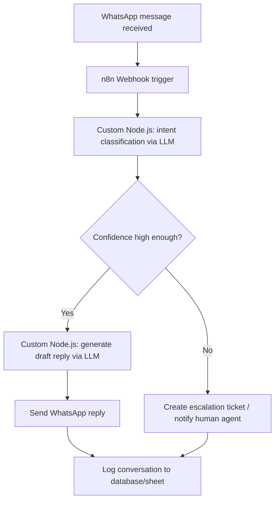

# Demo 01 — WhatsApp Agent

> 🚧 Placeholder — implementation in progress. This README describes the
> intended design; `workflow.json` and `code/` are not implemented yet.

An AI-assisted support agent for WhatsApp Business: it receives customer
messages, classifies intent, drafts a response using an LLM, and either
replies automatically or escalates to a human agent when confidence is low
or the request requires a person (refunds, complaints, etc.).

## Problem It Solves

Small and mid-sized businesses that handle customer support over WhatsApp
often can't staff round-the-clock responders, and simple keyword-based
chatbots fail on anything but the most rigid FAQ flows. This demo shows how
to combine n8n's WhatsApp integration with a custom Node.js/LLM layer to
handle common questions automatically, keep a human in the loop for
edge cases, and log every conversation for later review.

## Flow



## Requirements

- n8n (self-hosted or cloud) — v1.x
- Node.js — v18+
- WhatsApp Business API access (Meta Cloud API or BSP of choice)
- An LLM API key (e.g. Claude) for intent classification and reply drafting
- A place to log conversations (e.g. a database or Google Sheet) and, if
  escalation is enabled, a ticketing/notification target (e.g. Slack, email)

Environment variables are documented in [`.env.example`](.env.example).

## How to Run It

1. Import [`workflow.json`](workflow.json) into your n8n instance (see the
   root [README](../../README.md#how-to-import-a-workflow-into-n8n) for the
   general import steps).
2. Copy `.env.example` to `.env` and fill in your WhatsApp and LLM credentials.
3. Install dependencies for the custom nodes:
   ```bash
   cd code
   npm install
   ```
4. Configure the corresponding credentials inside n8n and point the workflow's
   custom-code nodes at the `code/` scripts.
5. Activate the workflow and send a test message to the connected WhatsApp
   number.

*Detailed setup steps will be expanded once the workflow and code are implemented.*
