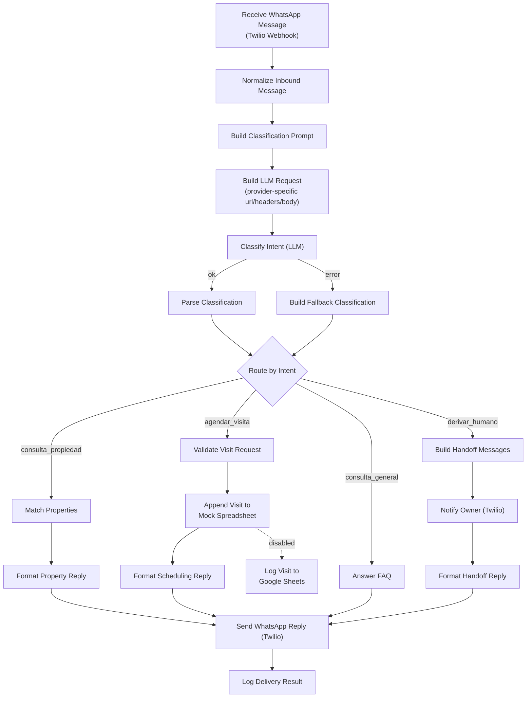

# Demo 01 — WhatsApp Agent (Real Estate Agency)

An AI-assisted WhatsApp agent for a real estate agency in Córdoba, Argentina.
It receives customer messages through the Twilio WhatsApp Sandbox, classifies
each one with an LLM, and answers automatically — searching the property
catalogue, booking viewings, answering FAQs — or hands the conversation over
to a human when it is not confident.

The LLM step is **provider-agnostic**: it defaults to **Gemini** (free tier,
no card required) but switches to Anthropic or Groq with a single environment
variable — see [LLM Provider](#llm-provider) below.

All customer-facing copy is in Rioplatense Spanish, the way an Argentinian
agency would actually write to its clients.

## Problem It Solves

Real estate agencies get the same handful of questions over WhatsApp all day:
*"do you have 2-bedroom apartments in Nueva Córdoba?"*, *"what do I need to
rent?"*, *"can I see it on Thursday?"*. Answering them manually eats the
sales team's day and leads go cold outside business hours.

This agent handles those three cases end to end and, critically, knows when to
stop: anything ambiguous, contractual, or low-confidence is escalated to a
human with the full context, instead of guessing.

## Flow



### The four intents

| Intent | What triggers it | What the agent does |
|---|---|---|
| `consulta_propiedad` | Asking for properties to rent or buy | Filters and scores the catalogue, replies with the top 3 matches |
| `agendar_visita` | Proposing or requesting a viewing | Validates date/time against business hours, records it, confirms |
| `consulta_general` | Hours, address, requirements, fees, valuations | Answers from a static FAQ set — no LLM call |
| `derivar_humano` | Complaints, contractual/legal topics, "I want to talk to someone", or low classifier confidence | Alerts the owner with full lead context, acknowledges to the customer |

### Design decisions worth noting

- **Provider-agnostic LLM step.** `Build LLM Request` reads `LLM_PROVIDER`,
  `LLM_MODEL` and `LLM_API_URL` and builds the right URL, headers and body for
  Gemini, Anthropic or Groq. Swapping providers is a config change, not a
  workflow edit.
- **One LLM call, not two.** The model returns the intent *and* the extracted
  entities (operation, property type, neighbourhood, bedrooms, budget, date,
  time) in a single request, because the property search needs those entities
  anyway.
- **The model's output is never trusted.** `Parse Classification` re-parses the
  JSON (tolerating markdown fences), checks the intent against a whitelist and
  enforces a minimum confidence of `0.6`. Anything that fails becomes
  `derivar_humano` — regardless of which provider produced it.
- **FAQs don't hit the LLM.** Keyword matching is instant, costs no tokens and
  always returns the same answer — which is what you want for facts like
  commission rates.
- **The search degrades gracefully.** If nothing matches exactly, it drops the
  neighbourhood filter first, then widens the budget by 15%, rather than
  replying "nothing found".
- **Explicit error handling on both external APIs.** See below.

### Error handling

| Failure | Behaviour |
|---|---|
| LLM API is slow or down | HTTP node retries 3× (2 s apart). If it still fails, the error output routes to `Build Fallback Classification`, which forces `derivar_humano` — the customer always gets an answer and the owner is notified (the alert names which provider failed). |
| LLM returns malformed JSON, an unknown intent, or a safety-blocked empty response | `Parse Classification` catches it (via `extractLlmText`, which returns `null` instead of throwing) and falls back to `derivar_humano`. |
| Owner notification fails | `Notify Owner` continues on error, so the customer still receives their reply. |
| Reply delivery fails | `Send WhatsApp Reply` retries 3×; the outcome is recorded by `Log Delivery Result`. No alert is attempted over WhatsApp — if WhatsApp is down, that alert would fail too. |
| Unknown intent reaches the router | The Switch's fallback output routes it to `derivar_humano`. |
| `LLM_PROVIDER` set to something unsupported | `Build LLM Request` throws immediately with a clear message — this is a deploy-time misconfiguration, not a per-message failure, so it is surfaced as a failed execution rather than silently guessed at. |

## Requirements

- **n8n** 2.x (built and verified against 2.8.4 / `n8n-nodes-base` 2.8.1)
- **Node.js** 18+ (developed on 22) — only needed to run the tests and the build script
- A **Twilio** account with the WhatsApp Sandbox enabled (free)
- An API key for **one** LLM provider — a free
  [Google AI Studio](https://aistudio.google.com/apikey) key works out of the
  box (default), or an Anthropic/Groq key if you prefer
- A public URL for your n8n instance so Twilio can reach the webhook
  (n8n Cloud gives you one; for local development use a tunnel such as
  `ngrok http 5678`)

No npm dependencies — the custom code uses only the Node standard library.

## Setup

### 1. Twilio WhatsApp Sandbox

1. In the [Twilio Console](https://console.twilio.com/), go to
   **Messaging → Try it out → Send a WhatsApp message**.
2. You'll see a sandbox number (usually `+1 415 523 8886`) and a join code
   like `join <two-words>`.
3. From every phone you want to test with — including the agency owner's —
   send that join code to the sandbox number over WhatsApp. Twilio only
   delivers messages to numbers that have joined.
4. Open the **Sandbox settings** tab. In **"When a message comes in"**, paste
   your n8n production webhook URL and set the method to **POST**:

   ```
   https://<your-n8n-host>/webhook/whatsapp-inmobiliaria
   ```

   While testing from the n8n editor, use the *test* URL instead
   (`/webhook-test/whatsapp-inmobiliaria`) and press **Execute workflow**
   before each message.
5. Copy your **Account SID** and **Auth Token** from the Console dashboard.

> The sandbox expires after 72 hours of inactivity — just re-send the join
> code if messages stop arriving.

### 2. Choose an LLM provider

Pick one — see [LLM Provider](#llm-provider) below for the full comparison —
and get an API key for it. **Gemini is the default** and is free.

### 3. n8n credentials

Create these two credentials in n8n (**Settings → Credentials → Add**):

| Credential type | Name it | Fields |
|---|---|---|
| **Twilio API** (`twilioApi`) | `Twilio — WhatsApp Sandbox` | Account SID, Auth Token |
| **Header Auth** (`httpHeaderAuth`) | `LLM Provider — API Key` | Name and Value depend on the provider — see the table below |

Then open the imported workflow and select them on the three nodes that need
them: `Classify Intent (LLM)`, `Notify Owner (Twilio)` and
`Send WhatsApp Reply (Twilio)`.

> Credentials are never stored in this repository. The workflow references
> them by n8n credential, and all non-secret configuration comes from
> environment variables.

### 4. Environment variables

Copy `.env.example` to `.env` and set the values on your n8n instance:

| Variable | Purpose | Example |
|---|---|---|
| `TWILIO_WHATSAPP_FROM` | Sandbox number that sends messages (E.164, no `whatsapp:` prefix) | `+14155238886` |
| `OWNER_WHATSAPP_NUMBER` | Where handoff alerts go — must have joined the sandbox | `+5493519876543` |
| `LLM_PROVIDER` | Which LLM to call: `gemini` (default), `anthropic` or `groq` | `gemini` |
| `LLM_MODEL` | Optional. Empty = provider's default model | `gemini-flash-latest` |
| `LLM_API_URL` | Optional. Overrides the provider's default endpoint entirely | *(leave empty)* |
| `AGENCY_NAME` | Agency name used in customer-facing copy | `Inmobiliaria Demo` |

**Required n8n setting:** n8n blocks environment access from inside nodes by
default. Set `N8N_BLOCK_ENV_ACCESS_IN_NODE=false` on the instance, otherwise
`$env` resolves to empty and the Twilio nodes have no `from` number.

> `.env` in this folder is a **template for you to copy values from** — n8n
> does not read `.env` files itself. The variables have to actually reach the
> n8n process's environment: `docker run -e VAR=value`, a Compose `environment:`
> block, a systemd `EnvironmentFile`, your PM2 config, etc., depending on how
> you run n8n. If a variable isn't set that way, every node reads it as empty
> and falls back to its documented default (e.g. `LLM_MODEL` empty → the
> provider's default model) — nothing breaks, but double-check this if a
> value you *did* set doesn't seem to take effect.

### 5. Import and run

```bash
# From this folder
npx n8n import:workflow --input=workflow.json
```

Or import `workflow.json` through the UI: **Workflows → Import from File**.

Then activate the workflow and send a WhatsApp message to the sandbox number.

## LLM Provider

`Build LLM Request` (`code/src/llmProviders.js`) builds the request for
whichever provider `LLM_PROVIDER` selects, and `Parse Classification` reads
the response back using the matching shape. Nothing else in the workflow
changes when you switch providers.

| | **Gemini** (default) | **Anthropic** | **Groq** |
|---|---|---|---|
| `LLM_PROVIDER` | `gemini` | `anthropic` | `groq` |
| Get a key | [aistudio.google.com/apikey](https://aistudio.google.com/apikey) — free tier | [console.anthropic.com](https://console.anthropic.com/) | [console.groq.com/keys](https://console.groq.com/keys) — free tier |
| n8n credential header **Name** | `x-goog-api-key` | `x-api-key` | `Authorization` |
| n8n credential **Value** | your API key | your API key | `Bearer <your API key>` |
| Default `LLM_MODEL` | `gemini-flash-latest` | `claude-sonnet-5` | `llama-3.3-70b-versatile` |
| Default endpoint | `generativelanguage.googleapis.com/v1beta/models/{model}:generateContent` | `api.anthropic.com/v1/messages` | `api.groq.com/openai/v1/chat/completions` |

All three credential types are the same n8n **Header Auth** credential
(`httpHeaderAuth`) — only the header Name/Value convention changes, since the
credential *type* is fixed per node. If you switch providers, edit that one
credential's Name and Value (or save a second credential and re-select it on
`Classify Intent (LLM)`).

### Example request bodies

**Gemini** — system instruction is a separate field, entities go in `contents`:

```json
{
  "system_instruction": { "parts": [{ "text": "Sos el clasificador de mensajes de una inmobiliaria..." }] },
  "contents": [{ "role": "user", "parts": [{ "text": "Fecha de hoy: 2026-08-03\n\nMensaje del cliente:\nHola" }] }],
  "generationConfig": { "temperature": 0, "maxOutputTokens": 400 }
}
```

**Anthropic** — Messages API, `system` is top-level, needs the
`anthropic-version` header:

```json
{
  "model": "claude-sonnet-5",
  "max_tokens": 400,
  "temperature": 0,
  "system": "Sos el clasificador de mensajes de una inmobiliaria...",
  "messages": [{ "role": "user", "content": "Fecha de hoy: 2026-08-03\n\nMensaje del cliente:\nHola" }]
}
```

**Groq** — OpenAI-compatible chat completions, system as a message:

```json
{
  "model": "llama-3.3-70b-versatile",
  "temperature": 0,
  "max_tokens": 400,
  "messages": [
    { "role": "system", "content": "Sos el clasificador de mensajes de una inmobiliaria..." },
    { "role": "user", "content": "Fecha de hoy: 2026-08-03\n\nMensaje del cliente:\nHola" }
  ]
}
```

### Using a fourth provider

Any endpoint compatible with one of the three shapes above works by pointing
`LLM_API_URL` at it (for example, a local Ollama server exposing an
OpenAI-compatible `/chat/completions` route — set `LLM_PROVIDER=groq` and
`LLM_API_URL` to your local endpoint). To support a genuinely different
response shape, add a branch to `buildLlmRequest` and `extractLlmText` in
`code/src/llmProviders.js` — both are covered by
`code/test/llmProviders.test.js`.

### Troubleshooting

**`Classify Intent (LLM)` errors and the conversation falls back to
`derivar_humano`.** Check the node's execution error first — with
`onError: continueErrorOutput` the workflow doesn't stop, so this fails
silently from the customer's side. Common causes:

- **`404 ... "This model models/X is no longer available to new users"`**
  (Gemini). Google periodically retires dated model snapshots for new API
  keys/projects, sometimes before the model disappears from the `/models`
  listing entirely — this bit us with `gemini-2.5-flash` while building this
  demo, which is why the default is now the `gemini-flash-latest` alias
  instead of a dated version. If it happens again with a different model,
  set `LLM_MODEL` to whatever `GET /v1beta/models` (with your key) currently
  lists as `generateContent`-capable.
- **`JSON parameter needs to be valid JSON`** on the HTTP node. This means
  `llmHeaders`/`llmBody` reached the node as JS objects instead of JSON
  strings — n8n's header handling doesn't accept objects and stringifies them
  with `String()` first, producing the literal `"[object Object]"`. Confirm
  `Build LLM Request` is still `JSON.stringify()`-ing both before returning.
- **401/403**: the Header Auth credential's Name/Value don't match the
  provider table above, or the key itself is invalid/expired.

## Custom Code

```
code/
├── src/
│   ├── properties.json         10 mock properties in Córdoba
│   ├── faq.json                agency FAQ entries
│   ├── matchProperties.js      filtering, scoring, progressive relaxation
│   ├── formatPropertyReply.js  customer-facing property listings
│   ├── answerFaq.js            keyword matching over the FAQ set
│   ├── scheduling.js           visit validation, records and replies
│   ├── llmProviders.js         per-provider request building + response parsing
│   └── parseClassification.js  validates the model's output, provider-agnostic
├── test/                       66 tests, node:test, no dependencies
└── scripts/build-workflow.js   injects src/ into the workflow's Code nodes
```

```bash
cd code
npm test                  # 66 tests
npm run build:workflow    # regenerate workflow.json from src/
npm run check:workflow    # fail if the committed workflow.json is stale
```

### Why there is a build step

n8n's Code node runs sandboxed and cannot `require()` local files, so the
logic has to live inside `workflow.json` itself. Keeping a second copy by hand
guarantees drift, so `code/src/` is the single source of truth and
`build-workflow.js` injects it between markers:

```js
// <<< BEGIN GENERATED — generado por code/scripts/build-workflow.js, no editar a mano >>>
...
// <<< END GENERATED >>>
```

`workflow.json` is committed already built, so importing it still works with
no build step. **Edit `code/src/`, never the JS inside the workflow.**

## Example Conversations

**Property search**

> **Customer:** Hola! busco depto en alquiler en Nueva Córdoba, 2 dormitorios, hasta 500 mil
>
> **Agent:** ¡Buenísimo! Encontré esta opción que encaja con lo que buscás 👇
>
> **1. Departamento de 2 dormitorios en Nueva Córdoba**
> 📍 Nueva Córdoba · Departamento en alquiler
> 💰 $495.000 por mes + $120.000 de expensas
> 📐 65 m² · 2 dormitorios · 1 baño · con cochera
> ✨ Cochera cubierta · Luminoso · Cerca de la UNC
> Ref: INM-002
>
> ¿Te interesa? Decime la referencia y qué día te queda cómodo, y coordinamos la visita. 🏠

**Booking a viewing**

> **Customer:** Quiero visitar la INM-002 el jueves a las 11
>
> **Agent:** ¡Listo! Anoté tu visita a la propiedad **INM-002** para el **jueves 6 de agosto a las 11:00 hs** 📅
>
> Un asesor de Inmobiliaria Demo te confirma por acá dentro de las próximas horas.

**General question**

> **Customer:** Qué requisitos piden para alquilar?
>
> **Agent:** Para alquilar pedimos: **recibo de sueldo** (o monotributo con facturación de los últimos 6 meses), **DNI** y **garantía propietaria en Córdoba** o seguro de caución. Si no tenés garante, trabajamos con seguro de caución y lo resolvemos en 48 hs.

**Human handoff**

> **Customer:** Quiero hablar con una persona, tengo un reclamo
>
> **Agent:** Dale, esto lo ve mejor una persona del equipo 🙌
>
> Ya le pasé tu consulta a un asesor de Inmobiliaria Demo. Te escriben por acá dentro del horario de atención.

*And the owner receives:*

> 🔔 **Consulta para atender**
>
> Cliente: Martín (+5493511234567)
> Motivo: El cliente pidió hablar con una persona
>
> Mensaje: "Quiero hablar con una persona, tengo un reclamo"

## Notes and Limitations

This is a portfolio demo, so a few things are deliberately simplified:

- **The property catalogue is mock data** in `code/src/properties.json`. In a
  real deployment this would query the agency's CRM or listing platform.
- **The visits "spreadsheet" uses n8n's workflow static data**, which needs no
  setup and persists across production executions — but *not* across manual
  runs from the editor. The disabled `Log Visit to Google Sheets` node shows
  the production path.
- **The USD→ARS rate is a constant** in `matchProperties.js`. Production would
  read it from an exchange rate API.
- **No conversation memory.** Each message is classified on its own. Adding
  history means persisting per-phone state and including it in the prompt.
- **Text messages only.** Audio and images are routed to a human.
