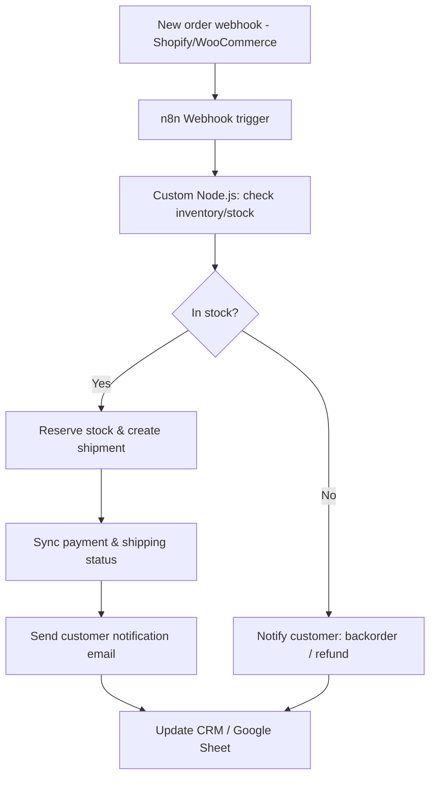

# Demo 02 — E-commerce Pipeline

> 🚧 Placeholder — implementation in progress. This README describes the
> intended design; `workflow.json` and `code/` are not implemented yet.

An order processing pipeline for e-commerce stores: a new order triggers
inventory checks, payment and shipping status sync, customer notifications,
and a CRM/spreadsheet update — all without manual intervention.

## Problem It Solves

Store owners running Shopify/WooCommerce (or similar) often stitch together
order fulfillment manually across inventory sheets, shipping providers, and
customer emails, which is slow and error-prone as order volume grows. This
demo automates that handoff: as soon as an order comes in, it validates
stock, keeps shipping/payment status in sync, notifies the customer at each
step, and keeps a CRM or Google Sheet updated as the single source of truth.

## Flow



## Requirements

- n8n (self-hosted or cloud) — v1.x
- Node.js — v18+
- E-commerce platform API access (Shopify Admin API, WooCommerce REST API, or similar)
- Shipping provider API (if automating label/shipment creation)
- Email provider (e.g. SMTP, SendGrid) for customer notifications
- CRM or Google Sheets API access for order tracking

Environment variables are documented in [`.env.example`](.env.example).

## How to Run It

1. Import [`workflow.json`](workflow.json) into your n8n instance (see the
   root [README](../../README.md#how-to-import-a-workflow-into-n8n) for the
   general import steps).
2. Copy `.env.example` to `.env` and fill in your store, shipping, and email
   credentials.
3. Install dependencies for the custom nodes:
   ```bash
   cd code
   npm install
   ```
4. Configure the corresponding credentials inside n8n and point the workflow's
   custom-code nodes at the `code/` scripts.
5. Activate the workflow and place a test order in your store.

*Detailed setup steps will be expanded once the workflow and code are implemented.*
