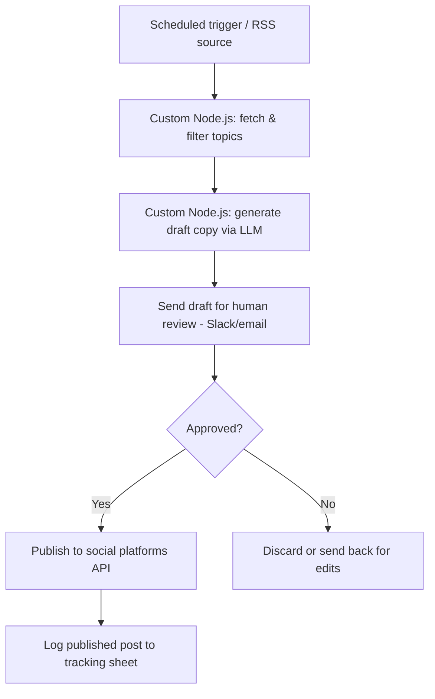

# Demo 03 — Content Automation

> 🚧 Placeholder — implementation in progress. This README describes the
> intended design; `workflow.json` and `code/` are not implemented yet.

A scheduled content generation and publishing pipeline: it pulls source
topics, drafts on-brand copy with an LLM, routes it through a human review
step, and publishes to one or more social platforms.

## Problem It Solves

Keeping a consistent posting schedule across social platforms is time
consuming, especially for small teams without a dedicated content person.
This demo automates the repetitive parts — sourcing topics, drafting copy,
and scheduling/publishing — while keeping a human-in-the-loop approval step
so nothing goes out without a quick review.

## Flow



## Requirements

- n8n (self-hosted or cloud) — v2.x
- Node.js — v18+
- An LLM API key (e.g. Claude) for copy generation
- Social platform API access (e.g. LinkedIn, Twitter/X, Buffer) for publishing
- A review channel (e.g. Slack webhook or email) for the approval step
- A tracking sheet or database for published-post logging

Environment variables are documented in [`.env.example`](.env.example).

## How to Run It

1. Import [`workflow.json`](workflow.json) into your n8n instance (see the
   root [README](../../README.md#how-to-import-a-workflow-into-n8n) for the
   general import steps).
2. Copy `.env.example` to `.env` and fill in your LLM and social platform
   credentials.
3. Install dependencies for the custom nodes:
   ```bash
   cd code
   npm install
   ```
4. Configure the corresponding credentials inside n8n and point the workflow's
   custom-code nodes at the `code/` scripts.
5. Activate the workflow and confirm the scheduled trigger fires as expected.

*Detailed setup steps will be expanded once the workflow and code are implemented.*
