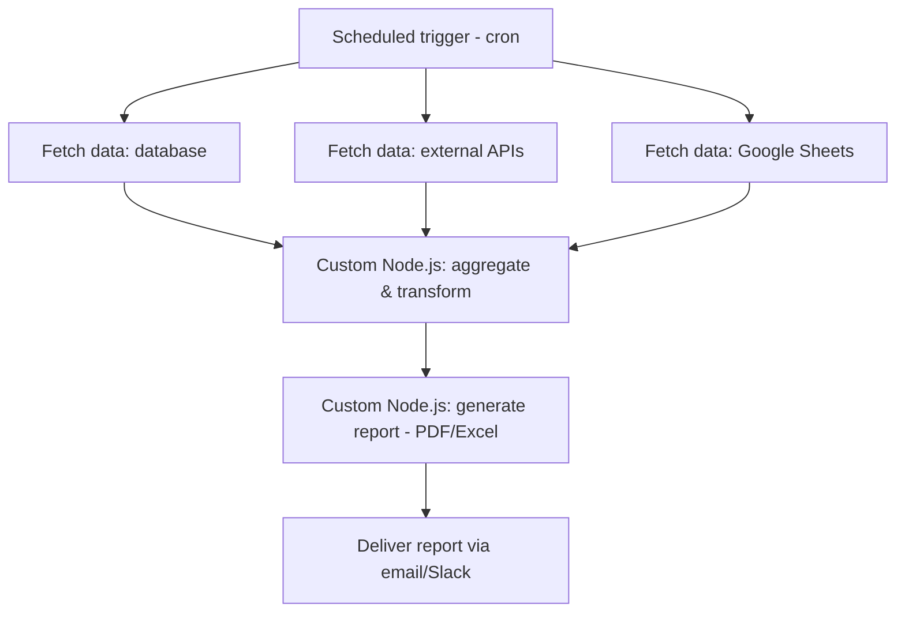

# Demo 04 — Reporting Pipeline

> 🚧 Placeholder — implementation in progress. This README describes the
> intended design; `workflow.json` and `code/` are not implemented yet.

A scheduled reporting pipeline: it pulls data from multiple sources (a
database, APIs, spreadsheets), aggregates and transforms it with custom
Node.js code, generates a report, and delivers it automatically by email or
Slack.

## Problem It Solves

Teams often spend hours each week manually pulling numbers from different
systems into a spreadsheet to build a recurring report. This demo automates
that end-to-end: on a schedule, it collects data from the relevant sources,
computes the metrics that matter, renders a report file, and delivers it to
stakeholders without anyone touching a spreadsheet.

## Flow



## Requirements

- n8n (self-hosted or cloud) — v2.x
- Node.js — v18+
- Access to the data sources being reported on (database connection, API keys, Google Sheets)
- A PDF/Excel generation library (e.g. `exceljs`, `pdfkit`) used by the custom code
- Email provider (e.g. SMTP, SendGrid) and/or Slack webhook for delivery

Environment variables are documented in [`.env.example`](.env.example).

## How to Run It

1. Import [`workflow.json`](workflow.json) into your n8n instance (see the
   root [README](../../README.md#how-to-import-a-workflow-into-n8n) for the
   general import steps).
2. Copy `.env.example` to `.env` and fill in your data source and delivery
   credentials.
3. Install dependencies for the custom nodes:
   ```bash
   cd code
   npm install
   ```
4. Configure the corresponding credentials inside n8n and point the workflow's
   custom-code nodes at the `code/` scripts.
5. Activate the workflow and trigger it manually once to confirm the report
   generates and delivers correctly before relying on the schedule.

*Detailed setup steps will be expanded once the workflow and code are implemented.*
